# 리덕스 공부하기


## 🔨 기본 용어

* store: Data 를 담는 저장소 

* state: 변경되는 Data 


* 리덕스에는 state를 저장하는 함수가 있다.

  * store가 하는 일은 state data를 넣을 수 있는 장소를 생성한다.

  * store를 저장하는 함수 사용 방법

    ```
    //리듀서 함수 생성
    const reducer = () => {};
    
    //stote에 리듀서 함수 추가
    const store = createStore(reducer);
    ```

* reducer: data를 수정하는 함수

  * data를 바꾸고 책임지는 기능
  * reducer가 return 하는 값이 data state가 된다.


## 🔨 reducer 개념

```
import { createStore } from "redux";

const add = document.getElementById("add");
const minus = document.getElementById("minus");
const number = document.querySelector("span");

const reducer = () => {
    return "hello";
};

const store = createStore(reducer);

console.log(store);

```


* store가 갖고있는 것은 함수를 갖고있다.
  * dispatch(), getState(), replaceReducer(), subscribe()

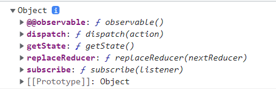


* score.getState() 를 이용하면 recuder 함수가 반환하는 state를 갖고올 수 있다.

```
const reducer = () => {
    return "hello";
};

const store = createStore(reducer);

console.log(store.getState());
```

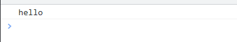


* redux의 data는 기본적으로 한곳에만 있다.

  * reducer에서 만든 데이터!
  * reducer 함수에서 유일하게 data를 바꿀 수 있다.

* recuder 함수가 state 값을 수정하고, 반환한 값이 store의 data가 된다

  ```
  const reducer = (state = "기본값") => {
      return state;
  };
  
  const store = createStore(reducer);
  console.log(store.getState());
  
  ```


## 🔨 Action

* action : redux에서 function을 부를때 사용하는 두번째 파라미터

  * reducer와 소통하기 위한 방법
  * type이라는 객체를 갖고있다.
  * type 객체에 redux에서 지정한 기본 값이 들어가있다.

  ```
  const reducer = (state = "기본값", action) => {
      console.log(state, action);
      return state;
  };
  
  const store = createStore(reducer);
  ```

  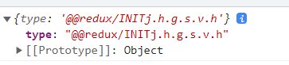


* action에 메시지를 전달하는 방법은 store.dispatch({type : }) 이용

  ```
  const reducer = (state = "기본값", action) => {
      console.log(state, action);
      return state;
  };
  
  const store = createStore(reducer);
  store.dispatch({ type: "헬로" });
  
  ```

  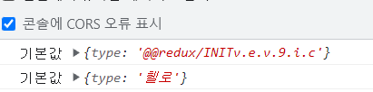


* action으로 보낸 메시지로 reducer에서 받아 분기처리 할 수 있다.

  ```
  const reducer = (state = 0, action) => {
      console.log(state, action);
  
      if (action.type === "ADD") {
          console.log("더하래~~");
      }
  
      return state;
  };
  
  const store = createStore(reducer);
  store.dispatch({ type: "ADD" });
  
  ```

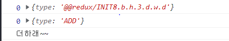


* reducer 함수가 return 하는 모든것은 data가 되기 때문에 return 하면 store에 저장되어있는 state를 변경할 수 있다.

  * 그리고 그것을 다시 .getState() 해서 가져올 수도 있다.

  ```
  const reducer = (state = 0, action) => {
      console.log(state, action);
  
      if (action.type === "ADD") {
          console.log("더하래~~");
          return state + 1;
      }
  
      return state;
  };
  
  const store = createStore(reducer);
  store.dispatch({ type: "ADD" });
  
  console.log(store.getState());
  ```

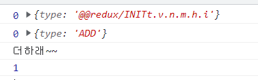


* 3번 ADD, 1번 MINUS 하는 경우 state 상태 변화

  ```
  
  const reducer = (state = 0, action) => {
      console.log(state, action);
  
      if (action.type === "ADD") {
          return state + 1;
      } else if (action.type === "MINUS") {
          return state - 1;
      }
  
      return state;
  };
  
  const store = createStore(reducer);
  store.dispatch({ type: "ADD" });
  store.dispatch({ type: "ADD" });
  store.dispatch({ type: "ADD" });
  
  console.log(store.getState());
  
  store.dispatch({ type: "MINUS" });
  
  console.log(store.getState());
  ```

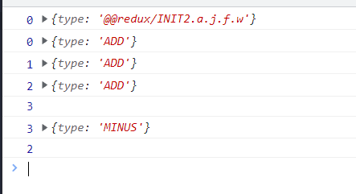


## 🔨 subscribe

* subscribe : store안에 있는 변화를 알수 있다.
* store를 구독하므로써 store안의 변화를 감지할 수 있다

```
const store = createStore(reducer);
const onChange = () => {
    console.log("변화하는 state", store.getState());
    number.innerText = store.getState();
};
//store를 구독하고있음
store.subscribe(onChange);
```


```
import { createStore } from "redux";

const add = document.getElementById("add");
const minus = document.getElementById("minus");
const number = document.querySelector("span");

const reducer = (state = 0, action) => {
    console.log(state, action);

    if (action.type === "ADD") {
        return state + 1;
    } else if (action.type === "MINUS") {
        return state - 1;
    }

    return state;
};

const store = createStore(reducer);
const onChange = () => {
    console.log("📞 스토어가 변하구 있다구!");
};
//store를 구독하고있음
store.subscribe(onChange);

const handleMinus = () => {
    console.log("TEST");
    store.dispatch({ type: "MINUS" });
};

//바로 넘기기
add.addEventListener("click", () => store.dispatch({ type: "ADD" }));
//함수로 만들기
minus.addEventListener("click", handleMinus);

```

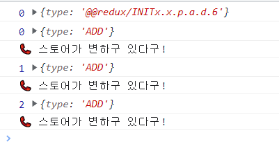


* 변경사항에 대한 리스너를 추가한다.
* 리스너는 action이 보내져서 state가 변경될 때마다 호출된다.
* 콜백 안에서 현재 state를 읽으려면 .getState()를 호출한다.

```
import { createStore } from "redux";

const add = document.getElementById("add");
const minus = document.getElementById("minus");
const number = document.querySelector("span");

const reducer = (state = 0, action) => {
    console.log(state, action);

    if (action.type === "ADD") {
        return state + 1;
    } else if (action.type === "MINUS") {
        return state - 1;
    }

    return state;
};

const store = createStore(reducer);
const onChange = () => {
    console.log("변화하는 state", store.getState());
    number.innerText = store.getState();
};
//store를 구독하고있음
store.subscribe(onChange);

const handleMinus = () => {
    store.dispatch({ type: "MINUS" });
};

//바로 넘기기
add.addEventListener("click", () => store.dispatch({ type: "ADD" }));
//함수로 만들기
minus.addEventListener("click", handleMinus);

```


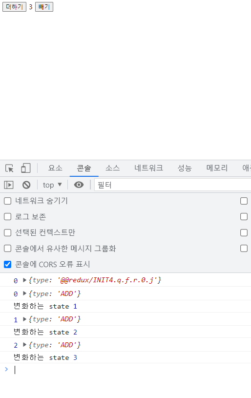

* 보통 reducer 함수에 switch case 구문을 많이 사용한다.

* action에서 사용하는 type은 변수로 지정하는게 관리하게 편하다.

  ```
  import { createStore } from "redux";
  
  const add = document.getElementById("add");
  const minus = document.getElementById("minus");
  const number = document.querySelector("span");
  
  number.innerText = 0;
  
  const ADD = "ADD";
  const MINUS = "MINUS";
  
  const reducer = (state = 0, action) => {
      console.log(state, action);
  
      switch (action.type) {
          case ADD:
              return state + 1;
          case MINUS:
              return state - 1;
          default:
              return state;
      }
  };
  
  const store = createStore(reducer);
  const onChange = () => {
      console.log("변화하는 state", store.getState());
      number.innerText = store.getState();
  };
  //store를 구독하고있음
  store.subscribe(onChange);
  
  const handleMinus = () => {
      store.dispatch({ type: MINUS });
  };
  
  //바로 넘기기
  add.addEventListener("click", () => store.dispatch({ type: ADD }));
  //함수로 만들기
  minus.addEventListener("click", handleMinus);
  
  ```


## 🔨 Todo List 만들기

### 추가

* state를 mutate 하면 절대 안된다!

  * mutating state하는 대신에 new state objects를 리턴해야 한다.

    * 원본 값을 직접 변경하지 않는다.

    ```
    switch (action.type) {
            case ADD_TODO:
                return state.push({ text: action.text, id: Date.now() });
    ```


    * 전개 연산자를 이용해서 새로운 객체를 만들어야한다.
    
    ```
    switch (action.type) {
            case ADD_TODO:
                return [...state, { text: action.text, id: Date.now() }];
    ```


```javascript
import { createStore } from "redux";

const form = document.querySelector("form");
const input = document.querySelector("input");
const ul = document.querySelector("ul");

//Action
const ADD_TODO = "ADD_TODO";
const DELETE_TODO = "DELETE_TODO";

//Reducer
const reducer = (state = [], action) => {
    console.log(action);

    switch (action.type) {
        case ADD_TODO:
            return [...state, { text: action.text, id: Date.now() }];
        case DELETE_TODO:
            return [];
        default:
            return state;
    }
};

const store = createStore(reducer);
store.subscribe(() => console.log(store.getState()));

const onSubmit = (e) => {
    e.preventDefault();
    const toDo = input.value;
    input.value = "";
    store.dispatch({ type: ADD_TODO, text: toDo });
};

form.addEventListener("submit", onSubmit);

```


### 삭제

* 삭제를 위해서 filter를 시용
  * filter를 이용해서 새로운 배열을 만든다.
* addTodo, deleteTodo는 그냥 따로 뺀거임

```h
import { createStore } from "redux";

const form = document.querySelector("form");
const input = document.querySelector("input");
const ul = document.querySelector("ul");

//Action
const ADD_TODO = "ADD_TODO";
const DELETE_TODO = "DELETE_TODO";

//action 메시지 빼기(중복 줄이기)
const addTodo = (text) => {
    return {
        type: ADD_TODO,
        text,
    };
};

const deleteTodo = (id) => {
    return {
        type: DELETE_TODO,
        id,
    };
};

//Reducer
const reducer = (state = [], action) => {
    console.log(action);

    switch (action.type) {
        case ADD_TODO:
            //앞에 두면, 맨 앞에 생김
            return [{ text: action.text, id: Date.now() }, ...state];
        case DELETE_TODO:
            return state.filter((todo) => todo.id !== parseInt(action.id));
        default:
            return state;
    }
};

const store = createStore(reducer);
store.subscribe(() => console.log(store.getState()));

const dispatchAddTodo = (text) => {
    store.dispatch(addTodo(text));
};

const dispatchDeleteTodo = (e) => {
    const id = parseInt(e.target.parentNode.id);
    store.dispatch(deleteTodo(id));
};

const paintTodos = () => {
    const toDos = store.getState();

    ul.innerHTML = "";

    toDos.forEach((toDo) => {
        const li = document.createElement("li");
        const btn = document.createElement("button");

        btn.innerText = "삭제";
        btn.addEventListener("click", dispatchDeleteTodo);

        li.id = toDo.id;
        li.innerText = toDo.text;

        li.appendChild(btn);
        ul.appendChild(li);
    });
};

//삭제를 위해서 다시 그려줘야한다.
store.subscribe(paintTodos);

const onSubmit = (e) => {
    e.preventDefault();
    const toDo = input.value;
    input.value = "";
    dispatchAddTodo(toDo);
};

form.addEventListener("submit", onSubmit);
```


# 리액트 리덕스


## 🔨 Provider


* React Redux에는 Provider컴포넌트를 통해 앱의 다른 컴포넌트에서 Redux store를 사용할 수 있음

  ```
  💾 index.js
  
  import React from "react";
  import ReactDOM from "react-dom";
  import { Provider } from "react-redux";
  import App from "./components/App";
  import store from "./routes/store";
  
  ReactDOM.render(
      <Provider store={store}>
          <App />
      </Provider>,
      document.getElementById("root")
  );
  
  ```


* sotore 파일은 별도로 만들어 줬다.

  ```
  💾 sotore.js
  
  import { createStore } from "redux";
  
  const ADD = "ADD";
  const DELETE = "DELETE";
  
  export const addTodo = (text) => {
      return {
          type: ADD,
          text,
      };
  };
  
  export const deleteDoto = (id) => {
      return {
          type: DELETE,
          id,
      };
  };
  
  const reducer = (state = [], action) => {
      switch (action.type) {
          case ADD:
              return [{ text: action.text, id: Date.now() }, ...state];
          case DELETE:
              return state.filter((toDo) => toDo !== action.id);
          default:
              return state;
      }
  };
  
  const store = createStore(reducer);
  
  export default store;
  
  ```


## 🔨 connect

* 컴포넌트들을 store에 연결시켜준다.
* connect는 두개의 파라미터를 갖는다.
  * state 또는 dispatch


* getCurrentState 함수를 만들고 connect로 감싼다.

* ```
  import React, { useState } from "react";
  import { connect } from "react-redux";
  
  function Home() {
      const [text, setText] = useState("");
      function onChange(e) {
          setText(e.target.value);
      }
      function onSubmit(e) {
          e.preventDefault();
          setText("");
      }
      return (
          <>
              <h1>To Do</h1>
              <form onSubmit={onSubmit}>
                  <input type="text" value={text} onChange={onChange} />
                  <button>Add</button>
              </form>
              <ul></ul>
          </>
      );
  }
  
  function getCurrentState(state, ownProps) {
      console.log(state, ownProps);
  }
  
  export default connect(getCurrentState)(Home);
  
  ```


* getCurrentState 함수에서 넘어온 state, ownProps를 출력해보자
  * 첫번째 state는 Redux store에서 온 state
  * 두번째 ownProps는 컴포넌트의 props로 react-router에 의해서 주어짐

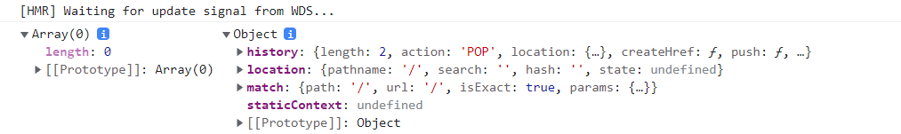


* connect()는 Home 컴포넌트로 보내는 props에 프로퍼티를 추가될 수 있도록 허용해준다
  * getCurrentState() 함수에서 return 해준 프로퍼티가 Home 컴포넌트의 props로 전달된다.
  * 이것도 react-router에 의해서 전달된다.

```
import React, { useState } from "react";
import { connect } from "react-redux";

function Home(props) {
    console.log("HOME 컴포넌트의 props", props);

    const [text, setText] = useState("");
    function onChange(e) {
        setText(e.target.value);
    }
    function onSubmit(e) {
        e.preventDefault();
        setText("");
    }
    return (
        <>
            <h1>To Do</h1>
            <form onSubmit={onSubmit}>
                <input type="text" value={text} onChange={onChange} />
                <button>Add</button>
            </form>
            <ul></ul>
        </>
    );
}

function getCurrentState(state, ownProps) {
    console.log(state, ownProps);

    //여기에 return 해서 넣어주면 HOME props의 프로퍼티로 넘어감
    return { sexy: true };
}

export default connect(getCurrentState)(Home);

```


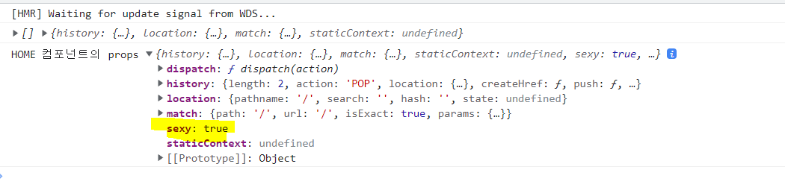


* state 값을 return 해준다면 컴포넌트에 sotre에 있는 state도 전달 가능하다.

  ```javascript
  import React, { useState } from "react";
  import { connect } from "react-redux";
  
  function Home(props) {
      console.log("HOME 컴포넌트의 props", props);
  
      const [text, setText] = useState("");
      function onChange(e) {
          setText(e.target.value);
      }
      function onSubmit(e) {
          e.preventDefault();
          setText("");
      }
      return (
          <>
              <h1>To Do</h1>
              <form onSubmit={onSubmit}>
                  <input type="text" value={text} onChange={onChange} />
                  <button>Add</button>
              </form>
              <ul></ul>
          </>
      );
  }
  
  function getCurrentState(state, ownProps) {
      console.log(state, ownProps);
  
      //여기에 return 해서 넣어주면 HOME props의 프로퍼티로 넘어감
      return { toDos: state };
  }
  
  export default connect(getCurrentState)(Home);
  
  ```

  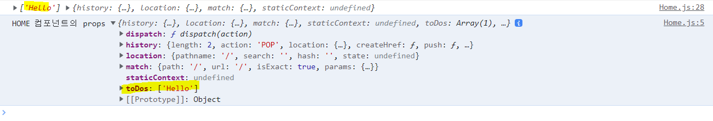


## 🔨 mapStateToProps

* 이름이 기본적으로 mapStateToProps() 이거여야 한다.
  * 리덕스 공식문서에 나와있음!
  * Redux state로부터 Home(component)에 props로 전달한다는 뜻

```
import React, { useState } from "react";
import { connect } from "react-redux";

function Home(props) {
    console.log("HOME 컴포넌트의 props", props);

    const [text, setText] = useState("");
    function onChange(e) {
        setText(e.target.value);
    }
    function onSubmit(e) {
        e.preventDefault();
        setText("");
    }
    return (
        <>
            <h1>To Do</h1>
            <form onSubmit={onSubmit}>
                <input type="text" value={text} onChange={onChange} />
                <button>Add</button>
            </form>
            <ul></ul>
        </>
    );
}

function mapStateToProps(state, ownProps) {
    console.log(state, ownProps);

    //여기에 return 해서 넣어주면 HOME props의 프로퍼티로 넘어감
    return { toDos: state };
}

export default connect(mapStateToProps)(Home);

```


## 🔨 mapDispatchToProps


* props의 dispatch 함수도 컴포넌트에서 넘겨받을 수 있다.

  ```
  import React, { useState } from "react";
  import { connect } from "react-redux";
  
  function Home(props) {
      console.log("HOME 컴포넌트의 props", props.toDos);
      console.log("HOME 컴포넌트의 dispatch", props.dispatch);
  
      const [text, setText] = useState("");
      function onChange(e) {
          setText(e.target.value);
      }
      function onSubmit(e) {
          e.preventDefault();
          setText("");
      }
      return (
          <>
              <h1>To Do</h1>
              <form onSubmit={onSubmit}>
                  <input type="text" value={text} onChange={onChange} />
                  <button>Add</button>
              </form>
              <ul></ul>
          </>
      );
  }
  
  function mapStateToProps(state, ownProps) {
      console.log(state, ownProps);
  
      //여기에 return 해서 넣어주면 HOME props의 프로퍼티로 넘어감
      return { toDos: state };
  }
  
  function mapDispatchToProps(dispatch, ownProps) {
      console.log(dispatch);
  
      return { dispatch };	//객체로 넘겨줘야한다.
  }
  
  //두번째로 넘겨주는게 dispatch 함수
  export default connect(mapStateToProps, mapDispatchToProps)(Home);
  ```


* props가history, location, match, addToDo를 갖고있다.
  * dispatch를 Home 컴포넌트에서 사용하지않는다.
  * addTodo 함수를 만들어서 dispatch에 전달한다.

```
import React, { useState } from "react";
import { connect } from "react-redux";
import { actionCreators } from "./store";

function Home({ toDos, ...rest }) {
    console.log(rest);

    const [text, setText] = useState("");
    function onChange(e) {
        setText(e.target.value);
    }
    function onSubmit(e) {
        e.preventDefault();
        setText("");
    }
    return (
        <>
            <h1>To Do</h1>
            <form onSubmit={onSubmit}>
                <input type="text" value={text} onChange={onChange} />
                <button>Add</button>
            </form>
            <ul></ul>
        </>
    );
}

function mapStateToProps(state, ownProps) {
    console.log(state, ownProps);

    //여기에 return 해서 넣어주면 HOME props의 프로퍼티로 넘어감
    return { toDos: state };
}

function mapDispatchToProps(dispatch, ownProps) {
    return { addTodo: (text) => dispatch(actionCreators.addTodo(text)) };
}

export default connect(mapStateToProps, mapDispatchToProps)(Home);

```

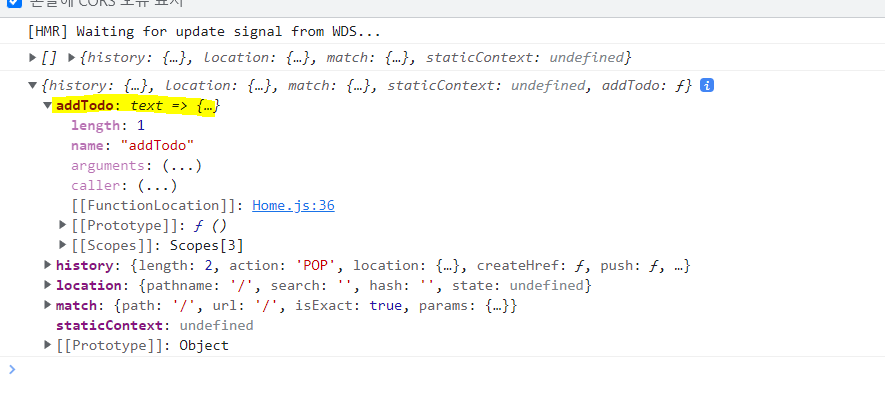


* reducer에게 dispach를 잘 하게된다.

```
import React, { useState } from "react";
import { connect } from "react-redux";
import { actionCreators } from "./store";

function Home({ toDos, addTodo }) {
    const [text, setText] = useState("");
    function onChange(e) {
        setText(e.target.value);
    }
    function onSubmit(e) {
        e.preventDefault();
        addTodo(text);
        setText("");
    }
    return (
        <>
            <h1>To Do</h1>
            <form onSubmit={onSubmit}>
                <input type="text" value={text} onChange={onChange} />
                <button>Add</button>
            </form>
            <ul>{JSON.stringify(toDos)}</ul>
        </>
    );
}

function mapStateToProps(state, ownProps) {
    console.log(state, ownProps);

    //여기에 return 해서 넣어주면 HOME props의 프로퍼티로 넘어감
    return { toDos: state };
}

function mapDispatchToProps(dispatch, ownProps) {
    return { addTodo: (text) => dispatch(actionCreators.addTodo(text)) };
}

export default connect(mapStateToProps, mapDispatchToProps)(Home);

```

